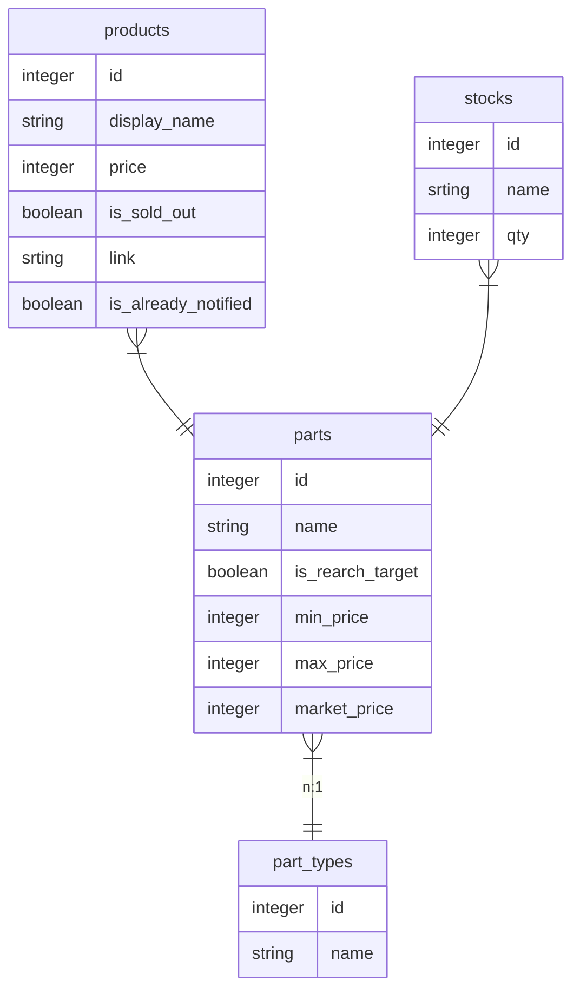

```mermaid
erDiagram

parts }| -- || part_types: "n:1"
products }| -- || parts: ""
stocks }| -- || parts: ""

part_types {
    integer id
    string name
}

parts {
    integer id
    string name
    boolean is_rearch_target
    integer min_price
    integer max_price
    integer market_price
}

stocks {
    integer id
    srting name
    integer qty
}

products {
    integer id
    string display_name
    integer price
    boolean is_sold_out
    srting link
    boolean is_already_notified
}
```